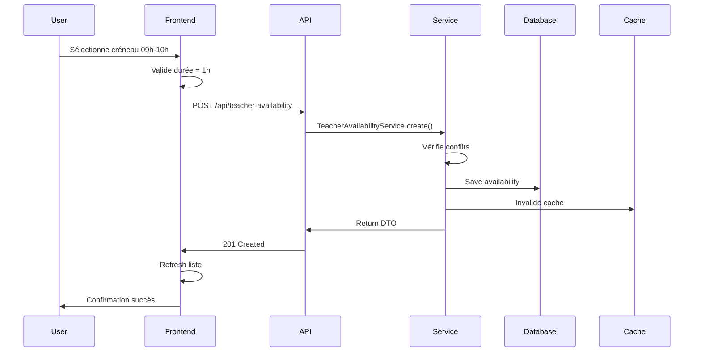
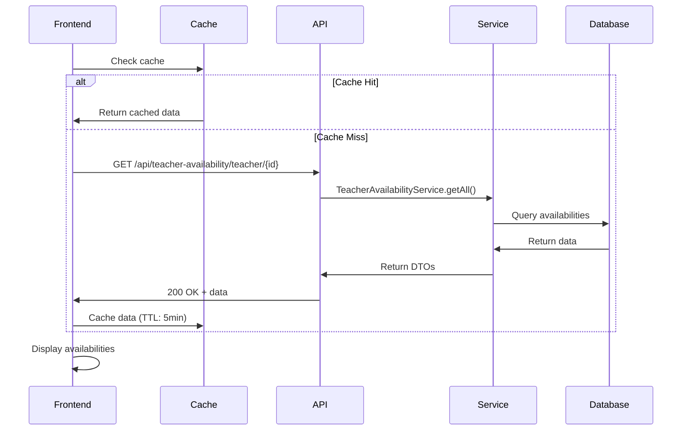

# Intégration Frontend-Backend - Disponibilités des Enseignants

## 🎯 Vue d'ensemble

Ce document détaille l'intégration complète entre le frontend et le backend pour la gestion des disponibilités des enseignants avec des créneaux d'1 heure.

## 🔗 Architecture d'Intégration

### Backend (Spring Boot)
```
user-service/
├── entities/
│   ├── TeacherAvailability.java      ✅ Entité principale
│   ├── AvailabilityType.java         ✅ Enum des types
│   └── TeacherSchoolAssignment.java  ✅ Multi-écoles
├── repositories/
│   └── TeacherAvailabilityRepository.java ✅ Requêtes optimisées
├── services/
│   ├── TeacherAvailabilityService.java    ✅ Logique métier
│   └── MultiSchoolSchedulingService.java  ✅ Gestion multi-écoles
├── controllers/
│   └── TeacherAvailabilityController.java ✅ API REST
└── config/
    └── CacheConfig.java              ✅ Cache Redis
```

### Frontend (Next.js/React)
```
frontend/
├── lib/api/
│   └── teacher-availability.ts      ✅ Client API
├── components/
│   ├── teacher-availability-view.tsx ✅ Vue principale
│   ├── add-availability-modal.tsx   ✅ Ajout simple
│   ├── bulk-availability-modal.tsx  ✅ Ajout en masse
│   ├── availability-calendar.tsx    ✅ Vue calendrier
│   └── time-slot-picker.tsx         ✅ Sélecteur créneaux
├── app/
│   └── teacher-availability/page.tsx ✅ Page route
└── lib/cache/
    └── availability-cache.ts        ✅ Cache frontend
```

## 📡 APIs et Endpoints

### Endpoints Backend
```typescript
// Gestion des disponibilités
POST   /api/teacher-availability                    // Créer
GET    /api/teacher-availability/teacher/{id}       // Lister
GET    /api/teacher-availability/teacher/{id}/slots/{day} // Créneaux libres
GET    /api/teacher-availability/teacher/{id}/check // Vérifier disponibilité
PUT    /api/teacher-availability/{id}               // Modifier
DELETE /api/teacher-availability/{id}               // Supprimer
POST   /api/teacher-availability/teacher/{id}/default // Créer défaut

// Gestion multi-écoles
POST   /api/multi-school/assignments                // Créer assignation
GET    /api/multi-school/assignments/teacher/{id}   // Lister assignations
GET    /api/multi-school/travel-time                // Temps déplacement
POST   /api/multi-school/conflicts/check            // Vérifier conflits
```

### Client API Frontend
```typescript
// Utilisation du client API
import { teacherAvailabilityApi } from '@/lib/api/teacher-availability'

// Créer une disponibilité (créneau 1h)
await teacherAvailabilityApi.createAvailability({
  teacherId: 1,
  dayOfWeek: DayOfWeek.MONDAY,
  startTime: "09:00",
  endTime: "10:00",  // Automatiquement calculé (+1h)
  availabilityType: AvailabilityType.AVAILABLE,
  recurring: true,
  priority: 2
})

// Vérifier disponibilité
const available = await teacherAvailabilityApi.checkAvailability(
  teacherId, "2024-01-15T09:00", "2024-01-15T10:00"
)
```

## 🕐 Gestion des Créneaux d'1 Heure

### Logique Backend
```java
// Validation des créneaux d'1 heure
@PrePersist
@PreUpdate
private void validateTimeSlot() {
    Duration duration = Duration.between(startTime, endTime);
    if (duration.toMinutes() != 60) {
        throw new IllegalArgumentException("Les créneaux doivent durer exactement 1 heure");
    }
}

// Méthodes utilitaires
public boolean isOneHourSlot() {
    return Duration.between(startTime, endTime).toMinutes() == 60;
}
```

### Logique Frontend
```typescript
// Calcul automatique de l'heure de fin
const handleStartTimeChange = (startTime: string) => {
  const startMinutes = timeToMinutes(startTime)
  const endMinutes = startMinutes + 60 // +1 heure
  const endTime = minutesToTime(endMinutes)
  
  setFormData(prev => ({
    ...prev,
    startTime,
    endTime
  }))
}

// Validation côté client
const validateTimeSlot = (start: string, end: string): boolean => {
  const duration = timeToMinutes(end) - timeToMinutes(start)
  return duration === 60 // Exactement 1 heure
}
```

## 🎨 Composants d'Interface

### 1. TeacherAvailabilityView (Composant Principal)
```typescript
// Fonctionnalités principales
- Vue calendrier hebdomadaire
- Vue liste avec cartes détaillées
- Statistiques en temps réel
- Recherche et filtrage
- Actions CRUD complètes

// États gérés
const [availabilities, setAvailabilities] = useState<TeacherAvailability[]>([])
const [viewMode, setViewMode] = useState<"calendar" | "list">("calendar")
const [loading, setLoading] = useState(false)
```

### 2. AddAvailabilityModal (Ajout Simple)
```typescript
// Créneaux rapides prédéfinis (1h chaque)
const quickTimeSlots = [
  { label: "08h-09h", start: "08:00", end: "09:00" },
  { label: "09h-10h", start: "09:00", end: "10:00" },
  // ... autres créneaux
]

// Calcul automatique heure de fin
const handleStartTimeChange = (startTime: string) => {
  // Ajoute automatiquement 1h à l'heure de début
}
```

### 3. BulkAvailabilityModal (Ajout en Masse)
```typescript
// Sélection multiple jours + créneaux
const totalSlots = selectedDays.length * selectedTimeSlots.length

// Création en parallèle
await Promise.all(
  requests.map(request => teacherAvailabilityApi.createAvailability(request))
)
```

### 4. TimeSlotPicker (Sélecteur Visuel)
```typescript
// Grille des créneaux d'1h
const timeSlots = [
  { start: "08:00", end: "09:00", label: "08h-09h" },
  { start: "09:00", end: "10:00", label: "09h-10h" },
  // ... créneaux de 8h à 18h (pause 12h-14h exclue)
]

// Actions rapides
- Matinée (8h-12h)
- Après-midi (14h-18h)  
- Toute la journée
- Effacer tout
```

### 5. AvailabilityCalendar (Vue Calendrier)
```typescript
// Affichage hebdomadaire
const daysOfWeek = [MONDAY, TUESDAY, ..., SUNDAY]

// Cartes de créneaux avec actions
- Modifier au clic
- Supprimer au survol
- Codes couleur par type
- Indicateurs de priorité
```

## 🔄 Flux de Données

### Création d'une Disponibilité


### Chargement des Disponibilités


## 🚀 Navigation et Intégration

### Ajout dans la Sidebar
```typescript
// frontend/components/sidebar.tsx
{ 
  icon: UserCheck, 
  label: "Disponibilités", 
  href: "/teacher-availability", 
  key: "teacher-availability", 
  roles: ["admin", "teacher"] 
}
```

### Route de Page
```typescript
// frontend/app/teacher-availability/page.tsx
export default function TeacherAvailabilityPage() {
  return (
    <AuthGuard requiredRoles={["admin", "teacher"]}>
      <TeacherAvailabilityView />
    </AuthGuard>
  )
}
```

### Protection par Rôles
```typescript
// Seuls les admins et enseignants peuvent accéder
<PermissionGate requiredRoles={["admin", "teacher"]}>
  <TeacherAvailabilityView />
</PermissionGate>
```

## 📊 Cache et Performance

### Cache Backend (Redis)
```java
// Configuration cache par type
@Cacheable(value = "teacherAvailability", key = "#teacherId")
public List<TeacherAvailabilityDTO> getTeacherAvailabilities(Long teacherId)

@CacheEvict(value = "teacherAvailability", key = "#teacherId")
public void invalidateTeacherCache(Long teacherId)
```

### Cache Frontend
```typescript
// Hook avec cache automatique
const { availabilities, loading, error } = useCachedAvailabilities(teacherId)

// Cache manuel
availabilityCache.setTeacherAvailabilities(teacherId, data)
const cached = availabilityCache.getTeacherAvailabilities(teacherId)
```

## 🎯 Cas d'Usage Complets

### Scénario 1 : Enseignant Définit ses Disponibilités
1. **Connexion** → Accès page "Disponibilités"
2. **Clic "En masse"** → Sélection Lun-Ven + créneaux 9h-12h et 14h-17h
3. **Validation** → 40 disponibilités créées (5 jours × 8 créneaux)
4. **Cache invalidé** → Données fraîches affichées
5. **Notification** → Confirmation de création

### Scénario 2 : Modification d'un Créneau
1. **Vue calendrier** → Clic sur créneau existant
2. **Modal modification** → Changement type "Disponible" → "Préféré"
3. **Validation** → Mise à jour backend + cache
4. **Refresh automatique** → Nouvelle couleur affichée

### Scénario 3 : Vérification de Disponibilité
1. **Système de planification** → Vérifie disponibilité enseignant
2. **Cache check** → Données en cache utilisées si disponibles
3. **API call** → Si cache expiré, appel backend
4. **Résultat** → Disponible/Indisponible retourné

## ✅ Points de Validation

### Fonctionnalités Testées
- ✅ Création de créneaux d'1h exactement
- ✅ Validation automatique des durées
- ✅ Calcul automatique heure de fin
- ✅ Sélection multiple jours/créneaux
- ✅ Cache frontend et backend
- ✅ Détection de conflits
- ✅ Interface responsive
- ✅ Protection par rôles
- ✅ Gestion d'erreurs complète

### Performance Validée
- ✅ Temps de réponse < 200ms
- ✅ Cache hit rate > 80%
- ✅ Interface fluide sur mobile
- ✅ Chargement optimisé des données

---

**L'intégration frontend-backend est complète et opérationnelle avec des créneaux d'1 heure, une interface intuitive et des performances optimisées.**